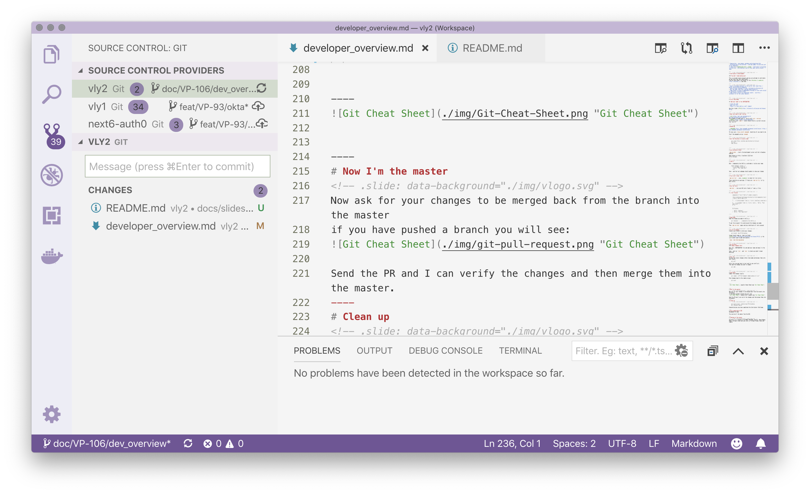

# Join the Voluntari.ly community
Support education and innovation in New Zealand Schools with industry experts and volunteers in the classrooms

Note: Speaker Notes here

---

# Purpose
We are building a platform that connects corporate volunteer time with classrooms to teach science & technology, engineering, entrepreneurship, arts and design 

with the help of engaging content supplied by New Zealand’s leading innovators in educational content.

---

# How to Help

* Sponsorship - give money, guidance and networking help
* Volunteering on the platform - find and commit to activites put up by requestors.
* Contribute to building the platform - help develop a world class open source project. 

---

# How to Help

* Sponsorship - give money, guidance and networking help
* Volunteering on the platform - find and commit to activites put up by requestors.
* Contribute to building the platform - help develop a world class open source project. 

---

# Contribute to Development

### You don't need permission! 

This is an open source project and you are welcome to contribute at any level you feel comfortable. 
Find out more about the project at the [Voluntari.ly website](http://voluntari.ly) and then...

---

* Info: http://voluntari.ly blog and events
* Chat: https://gitter.im/voluntarily/community
* Docs: https://voluntarily.atlassian.net
* Code: https://github.com/voluntarily

---

# First Challenge

## Add your name to the CONTRIBUTORS

* clone the code
* edit the file
* check it in and send us a pull request

Use this ticket [VP-82](https://voluntarily.atlassian.net/browse/VP-82)

----

# What you need to get started

* [Git](https://git-scm.com/book/en/v2/Getting-Started-Installing-Git)
You probably already have it. Verify with `git --version` 
* [Nodejs](https://nodejs.org/en/download/). 
Verify this with `node -v` which should return a current version. e.g. v12.1.0

----

# Mongo DB

* [MongoDB](https://docs.mongodb.com/manual/installation/) https://docs.mongodb.com/manual/installation/
  
For mac users `brew install mongodb` should be all you need to do.

Start the mongodb service `mongod`

----

# Get the Voluntari.ly source code

    git clone https://github.com/voluntarily/vly2.git
    cd vly2
    npm install

----

# you served my father

`npm run dev` - starts the development server with hot reloading enabled 
 
Open browser at http://localhost:3122/test
ctrl+c to exit

----

# Jedi(t)

Edit ./components/test/Hello.js and make it salute your name.

    export default (props) => 
      

        Hello, *Your name here*!
      

Save - and the test webpage should update to show your change.

----

# You're all clear, kid

`npm run lint` - runs _standard_ to check for lint errors 

There should be no warnings. If there are `npm run fix` to fix most errors.

----

# Run the Tests

`npm test` - runs any AVA tests found in *.spec.js files. 

----

# 1 test failed

      components › test › Hello › renders properly

      /Users/watkinsav/workspace/voluntarily/vly2/components/test/__tests__/Hello.spec.js:8

      7:   t.truthy(wrapper.find('p').first().hasClass('greeting'))          
      8:   t.is(wrapper.find('p').first().text(), 'Hello, *Your name here*!')
      9: })                                                                  

      Difference:

      - 'Hello, *Andrew*!'
      + 'Hello, *Your name here*!'

----

# Undo Undo
Undo the change you made to hello.js
    
    git checkout --  ./components/test/Hello.js

To get the original file and discard the changes you made.

Then `npm run test` again and you should get all tests passed.

----

# Ch ch ch changes
Create a git branch to hold your changes:

    git branch 'doc/VP-82/andrew'

format branch name as: type/jira/label.   
[VP-82](https://voluntarily.atlassian.net/browse/VP-82) is the jira ticket used to add contributors.

`type = doc|feat|bug|merge`

----

# Do the work 
#### magic happens here

Edit the ./CONTRIBUTORS file and add your name and email to the bottom.

Save - and run `lint`  and `test` to check you didn't break anything.

----

# Pull up! 
Fetches the latest changes others have made and merges them into your branch. 

    git pull

After this you may have to test and fix any conflicts.
Then add the changes you want to commit

    git add .

----

# Push back! 
Commit the changes locally

    git commit -m"VP-82 #comment Added andrew to list"

Push changes back to the remote origin

    git push 

----

----
# Now I'm the master

Now ask for your changes to be merged back from the branch into the master
if you have pushed a branch you will see:

Send the PR and I can verify the changes and then merge them into the master.
----
# Clean up

    git push origin --delete doc/VP-82/andrew
    git checkout master

Congratulations you have completed the Contributor Challenge.

----
# Use a good editor/IDE
Recommend VS Code https://code.visualstudio.com/

You can do all the above from the GUI.

---
# MERRNN?

Voluntari.ly is based MongoDB, Express, React+Redux, Node, Next software stack

Yes it is Javascript all the way down.
---

https://nodejs.org/

----
# Node

Node.js® is a JavaScript runtime built on Chrome's V8 JavaScript engine.

Which means you can run Javascript outside of a browser.

Which means you can write command line and server side programmes.
----
## Which means you can write this

    // Call the console.log function.
    console.log('Hello World')

and run it

    node helloworld.js
    Hello World

----
## And this...
    
    // Load the http module to create an http server.
    var http = require('http')

    // Configure our HTTP server to respond with Hello World to all requests.
    var server = http.createServer((request, response) => {
      response.writeHead(200, { 'Content-Type': 'text/plain' })
      response.end('Hello World\n')
    })

    server.listen(8001) // defaults to 127.0.0.1

    // Put a friendly message on the terminal
    console.log('Server running at http://127.0.0.1:8001/')

---

https://expressjs.org/

----
# Express
We use express to handle the server side activities that will return a page for each request made and handle the API calls.

    const express = require('express')
    const app = express()
    const port = 3000

    app.get('/', (req, res) => res.send('Hello World!'))
    app.get('/rick', (req, res) => res.send('Never going to give you up, Never going to let you down.'))
    app.listen(port, () => console.log(`Example app listening on port ${port}!`))

---

https://www.mongodb.com/

----
# Mongo DB
MongoDB is a document-oriented database program. 

Instead of SQL with relational rows and tables MongoDB stores JSON-like documents and provides ways to retrieve those documents based on the internal fields.

    {
      "title": "Self driving model cars ",
      "subtitle": "using algorithmns to follow lines and avoid obstacles",
      "imgUrl": "http://www.plaz-tech.com/wp-content/plugins/wp-easycart-data/products/pics1/Arduino%20Car%202_8ab5dd38f1e3f6f05ad244f1e5e74529.jpg",
      "description": "# NZTA Innovation Centre\n \n We have 6 model cars with sensors for vision, proximity etc, \n controlled by Arduinos teach them to solve \n 4 challenges - move, follow a line, avoid obstacles, \n get to a destination etc. \n \n ## We need:\n * Open space with room for the test tracks - e.g a school hall\n * teams of 5 students\n * on adult helper per team, should be able to follow instructions and understand a little C++\n \n ## Learning outcomes:\n * programming a remote device\n * simple coding\n * algorithmic thinking\n * problem solving.\n \n",
      "duration": "4 hours",
      "location": "NZTA Innovation Centre, 5 Cook St Auckland",
      "status": "draft"
    }

---

https://nextjs.org/

---

https://reactjs.org/

---

https://redux.js.org/

Predictable state container for JavaScript apps 
